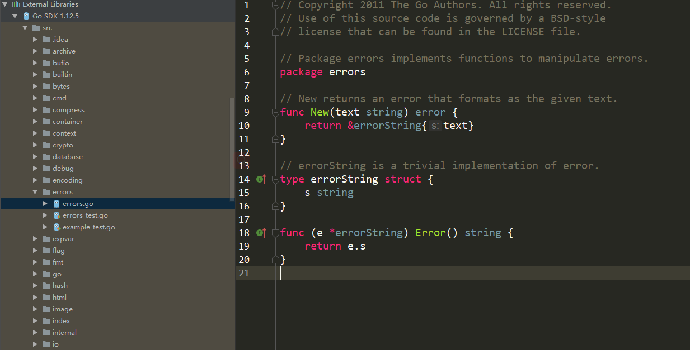
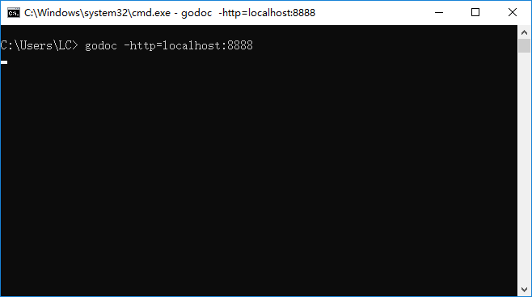
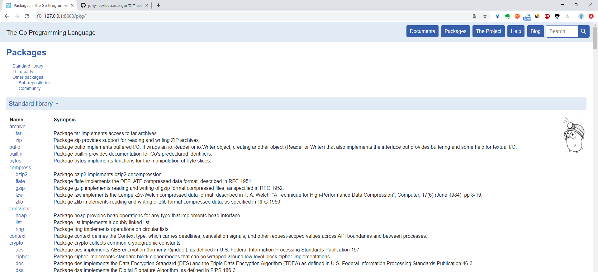

# go源码阅读指南

由于版本的迭代，我们在学习其他go语言教程或者是阅读他人写的go语言文章时，往往会碰见这样的代码，作者写在网上的教程和代码，复制到本地却报错不能执行。若是有错误，倒是可以通过错误信息找到问题所在。若是执行的代码结果和作者描述的结果不符，连报错都不报，我们该如何找到问题所在呢？

咨询大佬，这确实是一个不错的办法，可如果大佬迟迟不回，我们当然不能干瞪眼，无从下手。那么，最好的办法，就是阅读源码。

其实源码并没有我们想象中的遥不可及，我们经常需要调用的各种标准库源码，有的相当复杂，有的却特别简单。

就拿标准库errors的源码来讲，**加注释也不过20行代码**，并且不存在任何对其他包的依赖，几乎花几分钟就可以阅读完。

当然，阅读源码之前，需要对go语言中的所有语法有一定的了解，go的变量、表达式、函数、数据类型、方法、接口、并发等有大致的概念，否则，打开源码页面也只能是一头雾水，不知所云。

## 源码的正确打开方式

当有一定的go基础之后，我们便可开始阅读源码，源码保存在GOROOT的src目录下，阅读源码的方式有以下几种：

**1、本地源码**

打开GOROOT下的src目录，并直接打开任意的.go文件阅读

**2、官方文档**

访问官网的[官方文档](https://golang.google.cn/)或者利用`godoc`命令，打开本地官方文档

`godoc -http=localhost:8888`

运行上述命令后，在浏览器中输入`127.0.0.1:8888`访问本地官方文档

点击右上角Packages即可找到对应的包阅读文档。

**3、第三方文档翻译**

官方文档原生英语，不支持中文，阅读起来有一定的压力，网络上也有翻译成中文的源码文档，例如

[腾讯云开发者手册Go](https://cloud.tencent.com/developer/doc/1101)

## 最后

不同go语言的存在版本差异，阅读源码最好的方式是利用`godoc`生成本地的官方文档，在本地运行代码调试时以本地的源码为准，不易出错。

